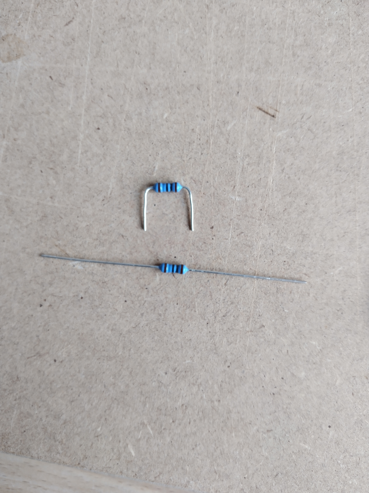
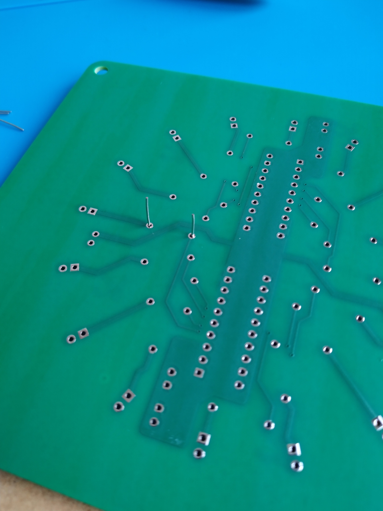

# ML01 PROJECT – ASSEMBLY GUIDE
**Recommended time: ~5 hours** depending on experience and available materials.

## A. REQUIRED MATERIALS
### A1. Soldering Equipment
- Soldering iron with temperature control (power of approximately 65W)
- Chisel soldering tip with 1.20 or 1.60 mm diameter
- Solder wire Sn99.3Cu0.7 (lead-free) 0.70 mm diameter
- Metal wool spiral for cleaning the soldering iron tip
- Damp sponge for additional tip cleaning
- Desoldering pump or desoldering wick (for corrections)
- Soldering mat (heat-resistant, ESD-safe recommended)

### A2. Tools
- Fine wire cutting pliers (flush cutters)
- Needle-nose pliers (for component placement and bending)
- PCB holder/stand for easier handling
- Foam pads to stabilize the PCB during soldering

### A3. Testing Equipment
- Digital multimeter (for continuity and short-circuit testing)
- Magnifying glass (for solder joint inspection)

### A4. Cleaning and Safety
- Good task lighting
- Fume extractor or well-ventilated workspace
- Flux remover spray with brush
- ESD thin protective gloves
- Safety glasses (protection from flying component leads and flux remover spray)

### A5. Check that you have all the components listed in the BOM
- Access the [BOM](../03_hardware/ML01-bom.pdf)
---

## B. PREPARATION
### B1. Safety precautions
**⚠️ Ventilation:** Work in a well-ventilated area or use a fume extractor. Do not inhale soldering fumes.  
**⚠️ Temperature:** Soldering iron reaches 360°C – handle with care and use a proper stand.  
**⚠️ Eye Protection:** Wear safety glasses when cutting component leads to prevent injury.  
**⚠️ Flux Remover:** Follow manufacturer's instructions carefully. Use in ventilated area and avoid skin/eye contact.  
**⚠️ ESD Protection:** Handle the components with antistatic precautions.

### B2. Resistors (16×)
**Difficulty level: easy**
**01.** Bend the resistor leads at a 90° angle to match PCB pad spacing.
**02.** Pre-form all 16 resistors to ensure consistent placement and centering on the PCB.
**03.** Pre-cut leads so they protrude approximately 6 mm from the PCB to maximize access.

  <table>
    <tr>
      <td align="center"></td>
      <td align="center"></td>
    </tr>
    <tr>
      <td align="center">01 & 02</td>
      <td align="center">03</td>
    </tr>
  </table>

  
  
   
  Légende image 1
  Légende image 3

  
  
  

### B3. TPIC6B595N Shift Registers (2×)
**Difficulty level: easy**
**01.** Slightly bend all IC pins **inward** to facilitate insertion into PCB holes.

### B4. PTC Resettable Fuse (1x) and Electrolytic Capacitor (1x)
This operation is optional: if you prefer to keep these 2 components straight, you don't need to bend the leads, the function will be the same.
**Difficulty level: medium**
**01.** Bend the resettable fuse leads at a 90° as shown in the photo, in order to minimize its size after welding.
**02.** Bend the electrolytic capacitor **(polarized, so pay attention to the mounting orientation)** leads at a 90° for the same reason as before.

## B5. Soldering Temperature Setup
**01.** Set soldering iron to 360°C (680°F) for lead-free Sn99.3Cu0.7 solder.
**02.** Allow a few minutes for the iron to reach stable temperature.
**03.** Clean tip with metal wool & damp sponge before starting.
---

## C. ASSEMBLY (COMPONENT PLACEMENT AND SOLDERING)
**General tips:**
- Solder one lead of the small components (two diagonally for the larger ones) and check its correct positioning before soldering the other leads.
- Regularly trim soldered component leads to maximize workspace.
- Use the "flip and press" method for components that don't hold themselves: insert components, flip PCB onto mat, solder from underside.
- Don't hesitate to use foam or shims to align the PCB horizontally as best as possible when it's upside down on the mat and ensure ideal component placement.
- For the others, use the PCB holder/stand.
**Summary of the assembly order:**
**01.** Resistors
**02.** TPIC6B595N (Power Shift Registers)
**03.** Ceramic Capacitors
**04.** Push Buttons
**05.** Raspberry Pi Pico 2W
**06.** LEDs
**07.** PTC (Resettable Fuse)
**08.** Electrolytic Capacitor

### C1. Resistors (16×)
**Difficulty level: easy**
**01.** Insert all 16 resistors into their designated positions on the PCB.
        - Resistors are **non-polarized** (orientation doesn't matter).
        - Ensure resistor bodies sit flat against the PCB surface.
**02.** Flip the PCB over and place it firmly on the soldering mat.
**03.** Solder all resistor leads on the underside of the PCB.
**04.** Trim excess leads with flush cutters, leaving ~2 mm protruding from solder joints.

### C2. TPIC6B595N Power Shift Registers (2×)
**Difficulty level: medium ⚠️ Correct orientation is essential**
**01.** Locate the silkscreen markings on the PCB showing IC orientation.
        - **Pin 1 indicator:** notch or dot on IC package.
        - **Pin 1 position on PCB:** marked with square pad or dot.
**02.** Insert first TPIC into PCB, aligning Pin 1 with PCB marking.
        - Ensure **all 20 pins** are correctly inserted into holes.
        - IC body must sit **flat and parallel** to the PCB surface.
**03.** Flip the PCB over and place it firmly on the soldering mat.
**04.** Solder **two opposite corner pins first** (e.g., Pin 1 and Pin 20).
        - This allows repositioning if IC is not flat.
        - Reheat corner pins and press IC down if needed.
**05.** Once IC is properly seated and straight, solder remaining 18 pins.
**06.** Repeat steps 01-05 for the second TPIC.
**07.** It's generally not necessary to cut the legs of TPICs after soldering because they are not very long.

### C3. Ceramic Capacitors (7×)
**Difficulty level: easy**
**01.** Insert all 7 ceramic capacitors into their designated positions.
        - Ceramic capacitors are **non-polarized** (orientation doesn't matter).
**02.** Use PCB stand for easier handling during soldering.
**03.** Solder all capacitor leads from the underside.
**04.** Trim excess leads.

### C4. Push Buttons (2×)
**Difficulty level: easy**
**01.** Insert both push buttons into their designated positions.
        - Buttons are **non-polarized** but have a specific footprint.
        - Ensure buttons are fully seated and perpendicular to PCB.
**02.** Use PCB stand for easier handling.
**03.** Solder all 4 pins per button.
**04.** No lead trimming required (buttons typically sit flush).

### C5. Raspberry Pi Pico 2W
**Difficulty level: medium ⚠️ Correct orientation is essential**
**01.** Identify correct orientation on PCB silkscreen.
        - **Micro-USB connector** should align with PCB marking.
        - Ensure **all 40 pins** align with PCB holes.
**02.** Insert Pico into PCB, then flip assembly the PCB onto mat
**03.** Check Pico to sit flush against PCB when flipped.
**04.** Solder **two opposite corner pins first** to secure position.
**05.** Check that Pico sits flat and parallel to PCB.
**06.** Solder remaining 38 pins.
**07.** Trim all Pico pins, leaving ~2 mm protruding.

### C6. LEDs (16× Yellow 5mm)
**Difficulty level: tricky ⚠️ Correct orientation is essential**
🐢 **Take your time because proper alignment is critical for appearance** 🐢
**01.** Identify LED polarity on **each LED**:
        - **Long lead = Anode (+)** → toward +5V rail (check PCB silkscreen)
        - **Short lead = Cathode (−)** → toward resistor connection
        - **Flat edge on LED lens** → cathode side
        - **PCB silkscreen:** align the flat edge of the LED with the flat edge marking
**02.** Insert first LED (position D1) with correct polarity, then flip PCB on the soldering mat.
**03.** Take the time to carefully check if the LED is properly seated and straighten it if necessary 
        - Use foam if needed to ensure the PCB is perfectly horizontal
**04.** Gently solder without moving **one leg only** (anode recommended because it's more accessible from the outside)
**05.** Repeat steps 01-04 for remaining 15 LEDs by depositing them symmetrically to be as stable as possible.
        - Led D2, then D16, then D15, then D3, then D4, then D14, etc.
        - Regularly trim the **soldered** leads if you want to free up space.
**06.** Flip the PCB and check that all the LEDs are perfectly aligned and soldered in the correct orentiation.
**07.** Flip again an finishes soldering all the cathode leads.
**08.** Trim all LED leads, leaving ~2 mm protruding.

### C7. PTC Resettable Fuse (1× Bourns MF-R050)
**Difficulty level: easy**
**01.** Insert fuse into designated position on PCB.
        - Fuse is **non-polarized** (orientation doesn't matter).
        - **Leave leads long** (~10-15 mm from PCB surface before bending).
**02.** Flip the PCB on the soldering mat an use foam to tackle the component to the PCB
        (or use PCB stand for easier handling if you keep the components straight)
**03.** Solder both fuse leads from underside.
**04.** Trim 2 leads, leaving ~2 mm protruding.

### C8. Electrolytic Capacitor (1× 100µF)
**Difficulty level: easy ⚠️ Correct orientation is essential**
**01.** Identify capacitor polarity:
        - **Longer lead = Positive (+)**
        - **Shorter lead = Negative (−)** – marked with stripe on capacitor body
        - **PCB silkscreen:** "+" symbol or silkscreen indication
**02.** Insert capacitor with correct polarity.
**03.** Flip the PCB on the soldering mat an use foam to tackle the component to the PCB
        (or use PCB stand for easier handling if you keep the components straight)
**04.** Solder both capacitor leads from underside.
**05.** Trim 2 leads, leaving ~2 mm protruding.
---

## D. POST-ASSEMBLY (FINISHING / INSPECTION / TESTING)
### D1. Lead Trimming
**01.** Inspect all solder joints from the underside of the PCB.
**02.** Trim any remaining long leads to ~2 mm from solder joint.
**03.** Wear safety glasses during this step.

### D2. Flux Removal ⚠️ Follow manufacturer's instructions
**01.** Apply flux remover spray to the underside of the PCB.
        - Work in a well-ventilated area.
        - Avoid contact with skin and eyes.
**02.** Use a small brush to scrub away flux residue.
**03.** Repeat these operations several times if necessary.

### D3. Visual Inspection
**01.** Examine all solder joints under good lighting (magnifying glass recommended):
        ✓ Joints should be **shiny and cone-shaped** (not dull or grainy).
        ✓ No **solder bridges** between adjacent pads.
        ✓ No **cold solder joints** (cracked or irregular appearance).
**02.** Check component orientation:
        ✓ TPICs: Pin 1 correctly oriented
        ✓ LEDs: All anodes (+) toward +5V rail
        ✓ Electrolytic capacitor: Positive (+) lead correctly placed
        ✓ Raspberry Pi Pico: Micro-USB connector oriented correctly
**03.** Verify all components are fully seated and perpendicular to PCB.

### D4. Electrical Testing (Multimeter Required)
**01.** Set multimeter to **continuity mode** (beep function).
**02.** **Check for short circuits:**
        ✓ Place one probe on +5V rail, other on GND: no continuity should be present (no beep).
        ✓ If continuity detected, inspect for solder bridges.
**03.** **Check +5V rail continuity:**
        ✓ VSYS pin on Raspberry Pi Pico (pin 39)
        ✓ VCC pins on both TPICs (pin 2)
        ✓ LED anodes (all 16)
**04.** **Check GND rail continuity:**
        ✓ GND pins on Raspberry Pi Pico
        ✓ GND pins on both TPICs (pins 10, 11, 19)

🎉 **CONGRATULATIONS! Your ML01 PCB assembly is complete but don't power on yet** ⚠️
---

## E. NEXT STEPS
**01.** Install 3D-printed stand to secure and display PCB.
**02.** Proceed to firmware setup – see `doc/ML01v01_setup.md` for:
        - Flash the MicroPython firmware
        - Configure and transfer programs to your pico
---

*Document revision date: 2026.01.10*
© RELEASE255 | All rights reserved
