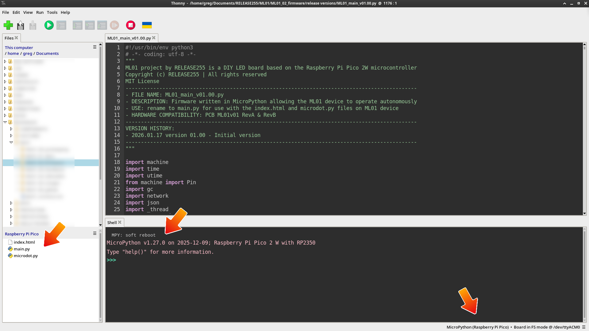
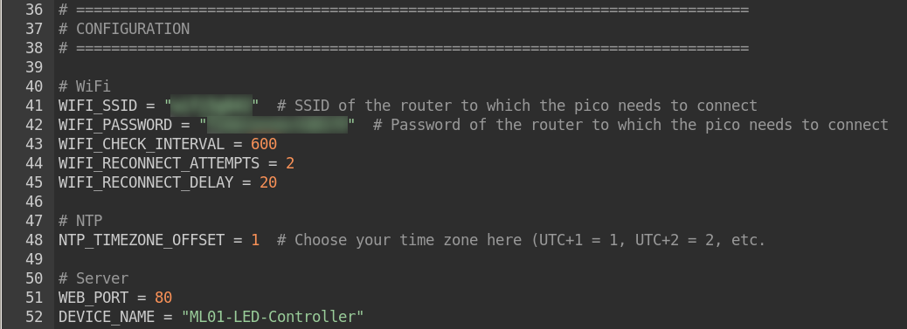
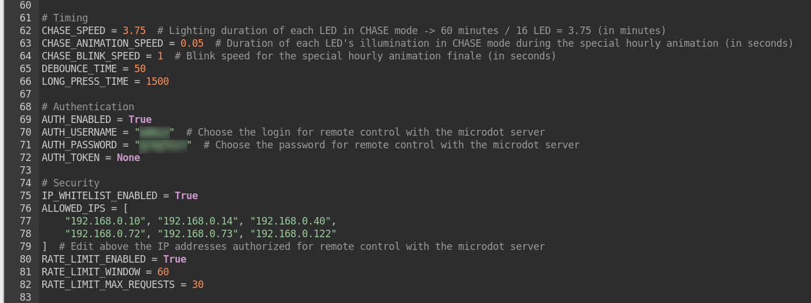

# ML01 PROJECT – SETTINGS GUIDE
This document guides you through the firmware installation and initial configuration of your ML01 device.

## A. PREREQUISITES
Before starting, ensure you have:  
✓ Fully assembled ML01 PCB (see 📖 [ASSEMBLY](../01_docs/ML01-assembly.md))  
✓ Micro-USB cable  
✓ 5.1V 2.5A power supply (for standalone operation after setup)  
✓ Computer running Linux, Windows, or macOS  
✓ Integrated development environment (IDE) such as Thonny with MicroPython interpreter  
✓ Internet connection (note that the Pico 2W is only compatible with a **2.4 GHz Wi-Fi network**)  
✓ Wi-Fi network with known SSID and password  
✓ Your computer's local IP address (instructions below)
###
---


## B. FLASH MICROPYTHON FIRMWARE TO RASPBERRY PICO 2W
⚠️ **This step is required before first use**
### B1. Download Firmware
- **01.** Visit https://micropython.org/download/RPI_PICO2_W/
- **02.** Download the latest stable release `.uf2` file.

### B2. Enter Bootloader Mode & Flash Firmware
- **01.** Locate the **BOOTSEL button** on the Raspberry Pi Pico 2W (small white button near the micro-USB connector).
- **02.** **Push and hold** the BOOTSEL button while connecting your Pico with a USB cable to your computer.
- **03.** **Release** the BOOTSEL button **once your Pico appears as a Mass Storage Device.**
- **04.** **Drag and drop** the MicroPython UF2 file onto the RPI-RP2 volume, your Pico will **automatically reboot.**
- **05.** **Wait** for the process to complete (~5 seconds).

### B3. Verify Firmware Installation
- **01.** **Disconnect** the Pico from your computer.
- **02.** **Reconnect** the Pico via micro-USB.
- **03.** Open your **IDE**.
- **04.** Make sure the Pico is recognized:  
        - With Thonny, check bottom-right corner.<br>
        - Should see "MicroPython (Raspberry Pi Pico)"<br>
        - If not, click the interpreter selector and choose it.<br>
- **05.** You should see the instructions below in the shell using Thonny editor:

<p align="center">
  
</p>

✅ **Firmware installation successful!**
###
---


## C. DOWNLOAD FIRMWARE FILES FROM GITHUB
Download the following three files from the `02_firmware/` folder [here](../02_firmware/):

```
02_firmware/
├── index.html      ← Web interface HTML file
├── main.py         ← Main control program
└── microdot.py     ← Lightweight web server library
```
---


## D. CONFIGURE main.py FILE
The `main.py` file contains all configuration parameters for your ML01 device.
### D1. Open main.py in Thonny
- **01.** In Thonny, click **File → Open...**
- **02.** Navigate to where you saved the firmware files.
- **03.** Open **main.py**.

### D2. Locate Configuration Section
- **01.** Press **Ctrl+F** (Windows/Linux) or **Cmd+F** (macOS) to open Find.
- **02.** Search for: `# CONFIGURATION`
- **03.** You should find the configuration section around **line 37** (may vary slightly):

<p align="center">
  
</p>

### D3. Configure Wi-Fi Settings
Locate the **WiFi** section:
```python
# WiFi
WIFI_SSID = "yourSSID"
WIFI_PASSWORD = "yourPassword"
```
- **01.** Replace `"yourSSID"` with your Wi-Fi network name.
- **02.** Replace `"yourPassword"` with your Wi-Fi password.

### D4. Configure Timezone (NTP)
Locate the **NTP** section:
```python
# NTP
NTP_TIMEZONE_OFFSET = 1
```
**Set your timezone offset relative to UTC, for example:**
| Location    | Offset | Value |
|-------------|--------|-------|
| Seoul       | UTC+9  | `9`   |
| Taipei      | UTC+8  | `8`   |
| Bengaluru   | UTC+5  | `5`   |
| Zurich      | UTC+1  | `1`   |
| London      | UTC+0  | `0`   |
| Boston      | UTC-5  | `-5`  |
| Palo Alto   | UTC-8  | `-8`  |

**Note:** This does not account for Daylight Saving Time (DST). Adjust manually if needed.

### D5. Configure LED Timing (Optional)
Locate the **Timing** section:

<p align="center">
  
</p>

- **01.** `CHASE_ANIMATION_SPEED`: Adjust the value as needed  
        - Default: `0.05` (50ms per LED)
        - Lower = faster animation
        - Higher = slower animation
- **02.** `CHASE_BLINK_SPEED`: Adjust the value as needed  
        - Default: `1` (1 second on/off cycle)

### D6. Configure Web Authentication
Locate the **Authentication** section:
- **01.** `AUTH_ENABLED`: Controls whether web interface requires login.  
        - `True` = Login required (recommended)
        - `False` = Open access (not recommended on shared networks)
- **02.** `AUTH_USERNAME`: Choose a username for web interface access.  
        - Default `AUTH_USERNAME = "admin"`
- **03.** `AUTH_PASSWORD`: Choose a secure password for web interface access.  
        - Default `AUTH_PASSWORD = "ML01secure!"`

### D7. Configure IP Address Whitelist
Locate the **Security** section:  
```python
ALLOWED_IPS = [
    "192.168.1.100",  # Your computer
    "192.168.1.105",  # Your phone
    "192.168.1.110"   # Another device
]
```
- Find your computer's local IP address and replace placeholder IPs with actual addresses you want to allow.
- **Purpose:** Restricts web interface access to specific IP addresses on your local network.
- To disable IP filtering entirely **(not recommended):** set `AUTH_ENABLED = False`

⚠️ **Security Recommendation:**  
✓ Change default `AUTH_USERNAME` and `AUTH_PASSWORD`.  
✓ Use strong passwords (mix of letters, numbers, symbols).  
✓ Keep `AUTH_ENABLED = True` on shared networks.  
✓ Update `ALLOWED_IPS` if your network changes (DHCP).  
✓ Consider setting **static IP** for your devices in router settings.  
✓ If `AUTH_ENABLED = True` and `ALLOWED_IPS = []` (empty list), **no devices can connect**.  
✓ Do not expose Pico to public internet without additional security measures.  
✓ Regularly update MicroPython firmware for security patches.
###

### D8. Save Configuration
- **01.** Review all changes carefully.
- **02.** In Thonny, click **File → Save** (or press **Ctrl+S** / **Cmd+S**).
- **03.** Keep the file open in Thonny for the next step.
---


## E. UPLOAD FILES TO RASPBERRY PI PICO
### E1. Connect Pico to Computer
Connect your Raspberry Pi Pico 2W to your computer via micro-USB cable (if it hasn't already been done).

### E2. Upload main.py
- **01.** With `main.py` open and configured in Thonny, click **File → Save As...**
- **02.** In the dialog, select **"Raspberry Pi Pico"** as the destination.
- **03.** Name exactly the file: **`main.py`** (allows the program to start automatically when the Pico is connected to the power supply).
- **04.** Click **OK** to upload.

### E3. Upload microdot.py
Do the same thing as before, saving the **`microdot.py`** file in the pico

### E4. Upload index.html
Do the same thing as before, saving the **`index.html`** file in the pico

### E5. Verify Files on Pico
- **01.** In Thonny, look at the **Files panel** (usually on the left side).
- **02.** Under **"Raspberry Pi Pico"**, you should see:
```
/
├── index.html
├── main.py
└── microdot.py
```

<p align="center">
  
</p>

✅ **All files successfully uploaded!**
###
---


## F. VERIFY INSTALLATION
### F1. Run Initial Test
- **01.** In Thonny, ensure the **`main.py`** tab is active.
- **02.** Click the **green "Run" button** (▶) or press **F5**.
- **03.** Monitor the **Shell panel** at the bottom of Thonny.

### F2. Check Console Output
You should see output similar to:
```
======================================================================
ML01 LED CONTROLLER - PICO 2W
======================================================================

MODES:
• OFF: All LEDs off
• ON: All LEDs on
• CHASE: Sequential LED movement

CONTROLS:
• Button 1 short: Switch mode
• Button 1 long: Shutdown
• Button 2 long: Manual restart
• Web: http://[IP_ADDRESS]

LED NOTIFICATIONS:
• Solid: WiFi connected
• OFF: WiFi disconnected
• Fast blink: New connection
----------------------------------------------------------------------

Initializing security...
[SYSTEM] Auth enabled (user: admin)
✓ Auth: admin
✓ IP filter: 6 allowed
✓ Rate limit: 30/60s
Initializing GPIO...
GPIO initialized
[SYSTEM] ML01 Controller started
Connecting to WiFi...
[SYSTEM] Syncing time with NTP...
[SYSTEM] Time synced: 31/12/2025 - 09:19:46
✓ Time synced (UTC+1)
[SYSTEM] Start time updated after NTP
Starting web server thread...
[WEB] Thread started
[WEB] Free memory: 402880 bytes
[WEB] Starting on port 80...
[WEB] http://192.168.0.124:80
[SYSTEM] Web server on http://192.168.0.124
✓ Web: http://192.168.0.124
  Login: yourLogin / yourPassword
Starting with mode ON1

[MEMORY] Periodic check - Free: 400768 bytes (6 logs)
```
✅ **Key indicators of success:**  
✓ Time synced (UTC+..)  
✓ Web: http://192.168.0.124 (IP adress in the example)  
✓ Onboard green LED on Pico 2W is lit 🟩

### F3. Note Your Pico's IP Address
- **01.** Look for the line: `[WEB] http://192.168.0.xxx:80`
- **02.** **Write down this IP address** – you'll need it to access the web interface.

### F4. Test Physical Buttons
- **01.** Press **Button 1** (short press): LEDs should cycle through modes: FULL → CHASE → OFF
- **02.** Observe console output:
```
[MODE] Mode: ON -> CHASE
[CHASE] Starting animation to LED 9
[CHASE] Animation complete, LED 9 active
[MODE] Mode: CHASE -> OFF
[MODE] Mode: OFF -> ON
... 
```
- **03.** Press **Button 1** (long press ~3 seconds): Script should stop with message: "Script stopped by user"
```
Button 1 long press - shutting down...
GPIO cleaned

==========================================
FINAL STATISTICS
Started: 31/12/2025 - 09:39:16
Total ON time: xxm
==========================================
Program terminated
```
- **04.** Press **Button 2** (long press ~3 seconds): Pico should reboot (console will show restart sequence)
```
Button 2 long press - restarting...
[SYSTEM] Manual restart initiated

==================================================
RESTARTING...
==================================================
```
**Note:** The Thonny console correctly displays the "restartig sequence" but then loses the connection: this is normal operation.  
The device remains controllable with its buttons or via the web interface, but no longer via Thonny.

✅ **If buttons respond correctly, hardware is functioning properly.**
### 🎉 CONGRATULATIONS 🎉 Your ML01 device is now configured and ready to run independently.
---


## G. STANDALONE OPERATION
### G1. Disconnect from Computer
- **01.** In Thonny, click the **red "Stop" button** (■) to halt the running script.
- **02.** Close Thonny.
- **03.** **Disconnect** the Pico from your computer.

### G2. Connect to Power Supply
- **01.** Connect the **5.1V 2.5A micro-USB power supply** to the Pico.
- **02.** The **`main.py`** script will **automatically start** on boot.
- **03.** Wait 5-10 seconds for:  
        ✓ Wi-Fi connection to establish<br>
        ✓ Synchronization with the NTP server<br>
        ✓ Web server to start<br>
        ✓ LEDs to activate in default mode<br>

### G3. Confirm Auto-Start
- **01.** Check that **LEDs illuminate** (FULL mode by default).
- **02.** Check that **Pico onboard LED** is lit.

### G4. To access the web interface and control your ML01 remotely
See 📖 [USAGE](../01_docs/ML01-usage.md) to know how to use ML01 for daily operation and monitoring, this document covers:  
- LED OPERATING MODES
- PHYSICAL BUTTON CONTROLS
- ONBOARD LED INDICATOR (Pico LED)
- WEB INTERFACE ACCESS
- WEB INTERFACE FEATURES
- SYSTEM STATISTICS
---


## H. TROUBLESHOOTING
### H1. Thonny doesn't detect Pico
✓ Ensure micro-USB cable supports **data transfer** (not just charging).  
✓ Try a different USB port on your computer.  
✓ Restart Thonny and reconnect Pico.  
✓ Re-flash MicroPython firmware.

### H2. "WiFi connection failed" error
✓ Verify SSID and password are correct (case-sensitive).  
✓ Ensure Wi-Fi network is **2.4 GHz** (not 5 GHz).  
✓ Move Pico closer to Wi-Fi router.  
✓ Check if network has MAC address filtering (whitelist Pico's MAC).  
✓ Restart your router.

### H3. No IP address displayed
✓ Ensure Wi-Fi credentials are correct.  
✓ Check that router DHCP is enabled.  
✓ Try connecting Pico to a different Wi-Fi network for testing.

### H4. LEDs don't light up
✓ Verify power supply provides 5.1V and sufficient current (2.5A).  
✓ Check solder joints on LED connections (see assembly guide).  
✓ Test with multimeter: measure voltage across LED anode (+5V) and cathode.  
✓ Verify TPIC6B595N orientation and wiring.

### H5. Buttons don't respond
✓ Check button solder joints.  
✓ Verify buttons are connected to correct GPIO pins (GPIO 4 and GPIO 5).  
✓ Test button continuity with multimeter.

### H6. "ModuleNotFoundError: microdot" error
✓ Ensure `microdot.py` is uploaded to Pico root directory.  
✓ Verify filename is exactly `microdot.py` (case-sensitive).  
✓ Re-upload `microdot.py` following corresponding section.

### H7. Script doesn't auto-start on power-up
✓ Ensure file is named exactly `main.py` on the Pico.  
✓ Check that `main.py` is in the **root directory** of Pico (not in a subfolder).  
✓ Verify no syntax errors in `main.py` (test run in Thonny first).

###
---


*Revision date: 2026.01.26*<br>
© RELEASE255 | All rights reserved
