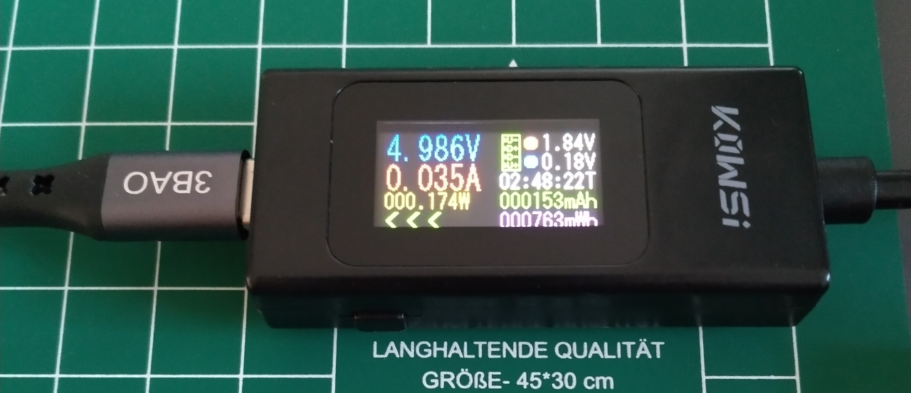
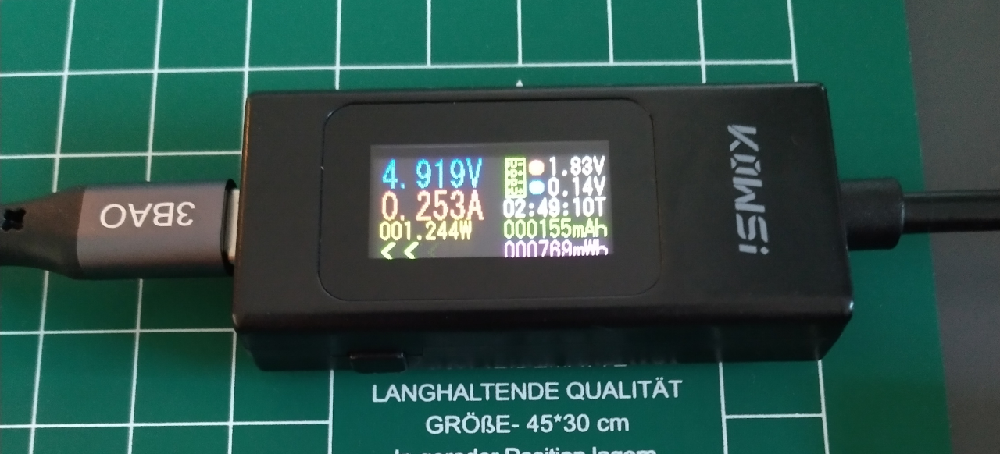
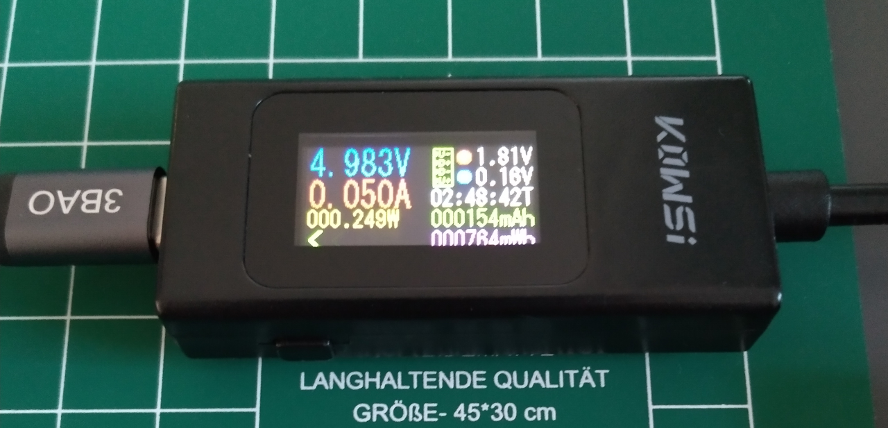
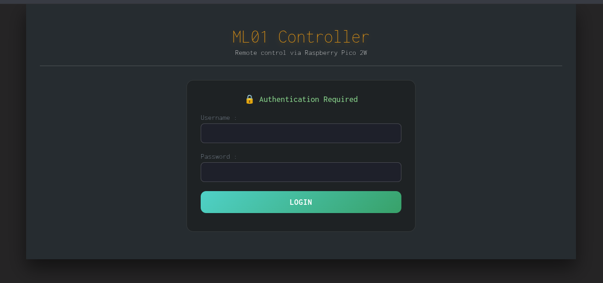
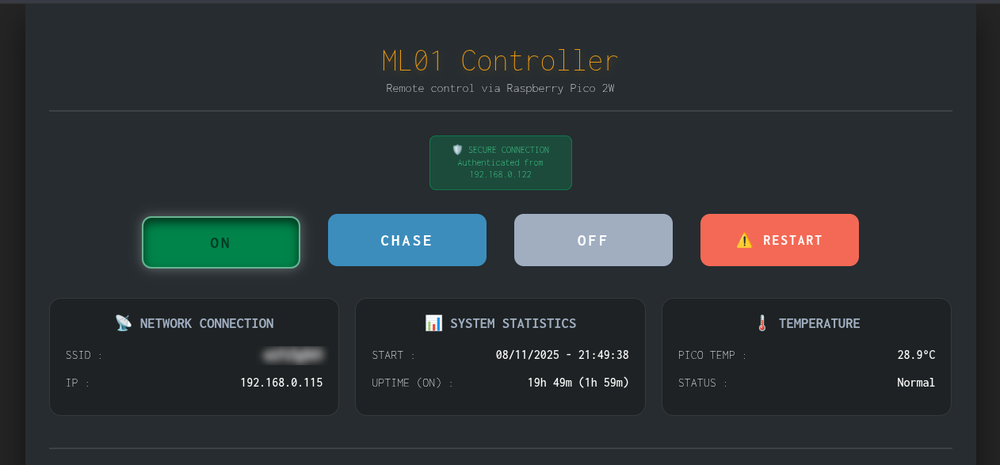
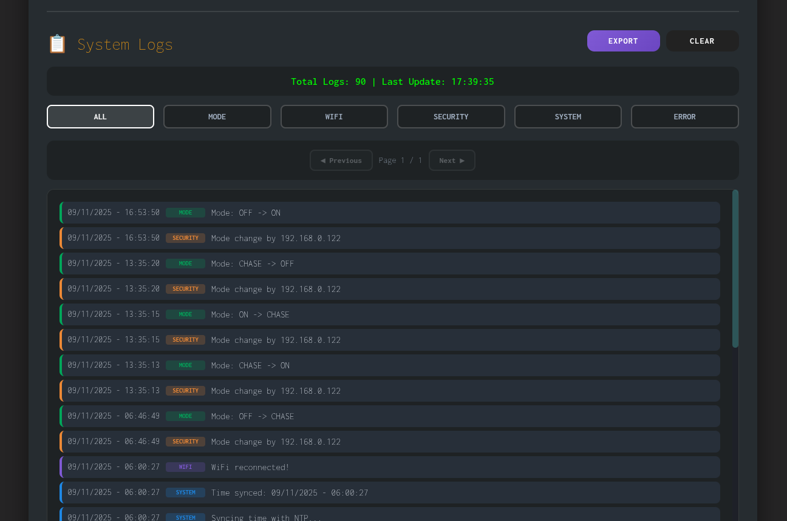

# ML01 PROJECT – USAGE GUIDE
This guide explains how to use your ML01 device for daily operation and monitoring.

**Key Features:**
- 16 controlled yellow LEDs
- 3 operating modes (OFF, FULL, CHASE)
- 2 physical button controls for local operation
- Web interface for remote control and monitoring
- Automatic NTP time synchronization
---


## A. LED OPERATING MODES
The ML01 is an LED controller featuring three operating modes, physical button controls, and a web-based remote interface.  
Once configured, the device operates autonomously with automatic Wi-Fi reconnection and time synchronization.
### A1. OFF Mode
- **Description:** All 16 LEDs are turned off.
- **Use case:** Power saving, nighttime operation, or when lighting is not needed.
- **Power consumption:** ~0.18 W (Pico only)

<p align="center">
  
</p>

### A2. FULL Mode
- **Description:** All 16 LEDs are continuously illuminated at full brightness.
- **Default behavior:** This is the default mode when the device starts.
- **Use case:** Maximum visibility, status indication, or testing all LEDs.
- **Power consumption:** ~1.25 W

<p align="center">
  
</p>

### A3. CHASE Mode
- **Description:** Visual indication of the time with only 1 LED lit at a time, and special hourly animation with all LEDs.
- **Regular minute display:**  
        ✓  Each LED illuminates for 3.75 minutes (225 seconds)<br>
        ✓  LED position synchronized with real-time clock (NTP)<br>
        ✓  Completes full cycle every 60 minutes (16 LEDs × 3.75 min = 60 min)<br>
- **Special Hourly animation (each HH:00:00) :**  
        ✓ All LEDs light up sequentially (LED 1 → 16), three times in a row<br>
        ✓ All LEDs flash simultaneously 3 times at 1-second intervals<br>
        ✓ Chase mode resumes with only LED 1 active<br>
- **Use case:** Visual time indicator, demonstration of sequential control, and fun!
- **Power consumption:** ~0.25 W

<p align="center">
  
</p>

---


## B. PHYSICAL BUTTON CONTROLS
The ML01 features 2 push buttons for local control without requiring network access.
### B1. Button 1 Functions
**Short Press (< 1.5 seconds):**
- Cycles through modes in sequence: FULL → CHASE → OFF → FULL → ...
- Each press advances to the next mode
- Mode change is logged in system logs

**Long Press (≥ 1.5 seconds):**
- Stops script execution and shuts down gracefully
- Turns off all LEDs
- Clears GPIO pins
- Displays final statistics in Thonny shell if connected

### B2. Button 2 Functions
**Short Press (< 1.5 seconds):**
- Currently not assigned (reserved for future functionality)

**Long Press (≥ 1.5 seconds):**
- Performs a full system restart
- Clears all logs stored in RAM
- Useful for occasionally recovering from errors
---


## C. ONBOARD LED INDICATOR (Pico LED)
The Raspberry Pi Pico 2W has a small onboard LED that provides status information:

| LED Behavior             | Meaning                                         |
|--------------------------|-------------------------------------------------|
| **Solid ON**             | Wi-Fi connected and operational                 |
| **OFF**                  | Wi-Fi disconnected or not configured            |
| **Fast blinking** (5 Hz) | New remote connection detected (for 10 seconds) |
---


## D. NETWORK FEATURES
### D1. Local Wi-Fi Connection
- Connects to **2.4 GHz Wi-Fi** networks only (5 GHz not supported)
- Configured via `main.py` during setup (see Settings Guide)
- Uses DHCP to obtain IP address automatically

### D2. Automatic Reconnection
- Checks Wi-Fi connection every **10 minutes**
- Attempts **2 reconnection cycles** if connection is lost
- Waits **20 seconds** between reconnection attempts
- Logs all connection events for troubleshooting

### D3. NTP Time Synchronization
- Synchronizes with NTP server on boot and after Wi-Fi reconnection
- Timezone offset configured in `main.py`
- Required for accurate CHASE mode timing and log timestamps
- Requires active internet connection (not just local Wi-Fi)
---


## E. WEB INTERFACE ACCESS
Finding Your Pico's IP Address with 2 methods:  
<br>
**Method 1: Thonny Shell during setup**  
When running the script in Thonny, the IP address is displayed in the shell output like in the example below:
```
[WEB] http://192.168.0.124:80
[SYSTEM] Web server on http://192.168.0.124
✓ Web: http://192.168.0.124
```
**Method 2: Router Admin Panel**
- Access your router's configuration page (usually `192.168.1.1` or `192.168.0.1`)
- Look for "Connected Devices" or "DHCP Client List"
- Find your device

### E1. Connecting to Web Interface
- **01.** Open a web browser on any device connected to the **same Wi-Fi network** as the Pico.
- **02.** Enter the Pico's IP address in the browser address bar, example: http://192.168.0.124  
**Note:** The web server runs on **port 80** (standard HTTP), so no port number is needed in the URL.
- **03.** If authentication is enabled (default), you will see a login prompt.
- **04.** Enter the credentials configured in `main.py`
- **05.** Click **"Log In"** or press Enter.

### E2. Screenshots and Interface Preview
**Authentication:**
<p align="center">
  
</p>

**Main Control Panel & System Statistics:**
<p align="center">
  
</p>

**Log Viewer:**
<p align="center">
  
</p>

---


## F. WEB INTERFACE FEATURES
### F1. Remote Control Buttons
The web interface provides four main control buttons:
- Press the **ON** button for FULL mode
- Press the **CHASE** button for time-synchronized display
- Press the **OFF** button to turns off all 16 LEDs immediately
- Press the **RESTART** button to reboots the Raspberry Pi Pico

### F2. System Information Display
The web interface shows also real-time system status:
#### **Network Information**
- **SSID:** Name of the Wi-Fi network the Pico is connected to
- **IP:** Current IP address of the Pico
#### **Operational Status**
- **START:** Date and time when the script started in `DD/MM/YYYY - HH:MM:SS` format
- **UPTIME:** Total time since device boot in format (time spent in FULL mode in parentheses)
#### **Temperature Monitoring**
- **PICO TEMP:** Internal temperature of the RP2350 microcontroller in °C
- **STATUS:** Temperature classification with color coding

| Temperature Range | Status       | Description                         |
|-------------------|--------------|-------------------------------------|
| < 50°C            | **Normal**   | Optimal operating temperature       |
| 50°C – 60°C       | **Warm**     | Slightly elevated, still safe       |
| 60°C – 70°C       | **High**     | Monitor closely, ensure ventilation |
| > 70°C            | **Critical** | Unlikely under normal operation     |

**Notes:**
- Temperature readings are approximate and for monitoring purposes only
- The RP2350 has a maximum operating temperature of 85°C, but sustained operation above 70°C is not recommended
- No automatic action is taken if temperature exceeds thresholds (temperature warnings are informational only)

### F3. System Logs
The web interface includes a comprehensive logging system for monitoring and troubleshooting.
#### **Log Display Features**
- **Pagination:** Displays 100 log entries per page (up to 10 pages)
- **Newest first:** Most recent logs appear at the top of page 1
- **Total capacity:** Stores up to **1,000 log entries** in RAM
- **Auto-rotation:** When limit is reached, oldest entries are automatically deleted

#### **Log Categories**
Logs can be filtered by category:

| Category     | Description                           |
|--------------|---------------------------------------|
| **ALL**      | Shows all log entries                 |
| **MODE**     | LED mode changes                      |
| **WIFI**     | Wi-Fi connection events               |
| **SECURITY** | Access control and authentication     |
| **SYSTEM**   | System operations & Time sync         |
| **ERROR**    | Errors, connection or NTP sync failed |

#### **Log Entry Format**
Each log entry contains:
- **Timestamp:** Date and time in `DD/MM/YYYY - HH:MM:SS` format
- **Type:** Category label (MODE, WIFI, SECURITY, SYSTEM, ERROR)
- **Message:** Detailed description of the event

#### **Export Logs to CSV with EXPORT Button**
- Downloads all current logs as a CSV file
- Filename in `ml01_logs_YYYYMMDD_HHMMSS.csv` format

#### **Clear Logs with CLEAR Button**
- Deletes all log entries from RAM
- Frees up memory (could be useful if you are approaching the entry limits)
---


## G. SYSTEM STATISTICS (Thonny Shell Only or similar IDE software)
When stopping the script using **Button 1 long press**, the device displays final statistics in the Thonny shell if connected.  
Note that these statistics are not shown in the web interface:
```
Button 1 long press - shutting down...
GPIO cleaned

==========================================
FINAL STATISTICS
Started: 31/12/2025 - 09:39:16
Total ON time: xxm
==========================================
Program terminated
```
---

## H. IMPORTANT NOTES
### H1. Reminder Of The Safety and Usage Rules Detailed in 📖 [SPECIFICATIONS](../01_docs/ML01-specifications.md)
⚠️ **LIMITATIONS AND WARNINGS** ⚠️
- **Indoor use only**
- **Always use the recommended power supply**
- **Not CE/FCC certified** | Hobbyist/educational use only
- **DIY assembly required** | Soldering skills necessary
- **Open PCB design** | Avoid contact with conductive materials
- **ESD sensitive** | Handle with antistatic precautions
- **No over-voltage protection** beyond PTC fuse
- **Wi-Fi stability** depends on local environment and interference

### H2. Data Persistence
- Logs are NOT persistent
- All logs are stored in RAM only
- Logs are completely erased when the Pico reboots
- Export logs to CSV before restarting if you need to keep them
- Statistics are NOT persistent
- Uptime and ON-time counters reset to zero on reboot
- If you need historical data, note statistics before restarting

### H3. Log Rotation
- Maximum 1000 log entries stored in RAM
- When limit is reached, oldest entries are automatically deleted
- New logs continue to be added (FIFO: First In, First Out)
- Export logs periodically if you need long-term records

### H4. Security Considerations
- If `AUTH_ENABLED = True` in `main.py`, all web access requires username/password
- Credentials are transmitted using HTTP Basic Authentication
- Not encrypted – suitable for local networks only, do not expose to public internet
- If `IP_WHITELIST_ENABLED = True` and `ALLOWED_IPS` is populated, only specified IP addresses can access the web interface
- Empty `ALLOWED_IPS` list with authentication enabled = **no one can connect**
- Update `ALLOWED_IPS` if your device IP changes (DHCP)
---


## I. TROUBLESHOOTING COMMON ISSUES
### I1: Web interface not loading
- **01.** Verify Pico is connected to Wi-Fi (check onboard LED – should be solid ON)
- **02.** Confirm you're on the **same Wi-Fi network** as the Pico
- **03.** Verify IP address is correct (check Thonny shell or router)
- **04.** Check if your IP is in `ALLOWED_IPS` list (if IP filtering enabled)
- **05.** Try accessing from a different device to rule out browser/firewall issues
- **06.** Restart the Pico

### I2: "Authentication required" prompt keeps appearing
- **01.** Verify you're entering the correct username and password from `main.py`
- **02.** Check for **extra spaces** in credentials (copy-paste carefully)
- **03.** Try a different browser (cached credentials may be incorrect)
- **04.** If you forgot the password, you must:  
        - Edit `main.py` in Thonny<br>
        - Change `AUTH_USERNAME` and/or `AUTH_PASSWORD`<br>
        - Re-upload `main.py` to the Pico<br>
        - Restart the Pico<br>

### I3: "Access denied" error
Your IP address is not in the `ALLOWED_IPS` whitelist:
- **01.** Find your device's current IP address
- **02.** Edit `main.py`
- **03.** Add your IP to the `ALLOWED_IPS` list
- **04.** Re-upload `main.py` to the Pico
- **05.** Restart the Pico

### I4: CHASE mode LED position incorrect
- **01.** Check logs for "Time synced" message
- **02.** Ensure internet connection is available (not just local Wi-Fi)
- **03.** Restart Pico to force NTP sync
---


## J. RELATED DOCUMENTATION
- see 📖 [SPECIFICATIONS](../01_docs/ML01-specifications.md)
- see 📖 [ASSEMBLY GUIDE](../01_docs/ML01-assembly.md)
- see 📖 [SETTINGS GUIDE](../01_docs/ML01-settings.md)

**For technical support or questions, please open an issue on the GitHub repository.**
###
---


*Revision date: 2026.01.17*<br>
© RELEASE255 | All rights reserved
