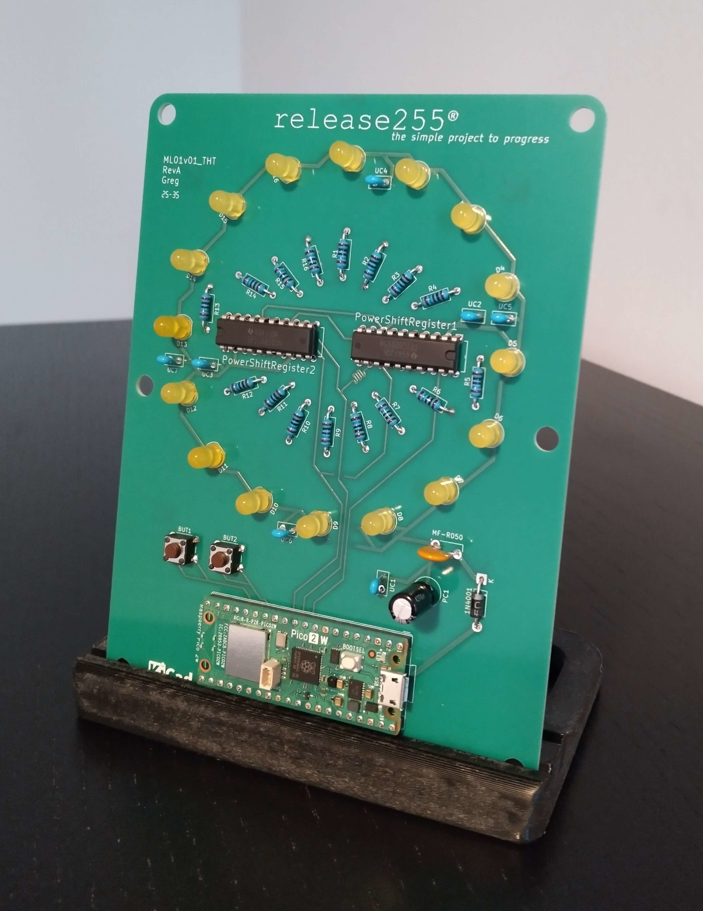

# ML01 project by RELEASE255
**DIY LED Board Powered by Raspberry Pico 2W**

[](/03_hardware/)
[](/02_firmware/)
[](/01_docs)
[](01_docs/costs.pdf)
[](LICENSE.md)



---

# 💡 Overview

**ML01** is a fully DIY through-hole LED board driven by a **Raspberry Pi Pico 2W** and two **TPIC6B595** shift registers. Built for enthusiasts makers, learners, and creative tinkerers, this product combining:

- Electronics learning
- Soldering practice
- Microcontroller programming
- Wireless control via Microdot
- Possibility to customize the firmware and hardware
- Open hardware philosophy with protected PCB design

---

# 📋 Key Features

- **LED Circle** | 16 yellow LEDs driven by 2× TPIC power shift registers
- **Physical Controls** | 2 buttons to switch operating modes
- **Wireless Web Interface** | Autonomous Microdot server for full remote control
- **Mode 1 (FULL)** | Turn all LEDs on 
- **Mode 2 (CHASE)** | Minute indicator synchronized via an NTP server
- **100% DIY THT** | Perfect for beginners and maker who wish to assemble or repair their product
- **Upgradable Firmware** | New modes and features can be added anytime
- **Easy Powered** | Works with the included 12.5 W PSU or via USB
- **Budget Friendly** | Transparent and moderate costs coupled with low consumption (~1 Wh)

---

# 📦 Contents of the Kit

- 01x PCB
- 01x Raspberry Pi Pico 2W (THT version)
- 01x Raspberry power supply 12.5 W (5.1 V / 2.5 A)
- 02x TPIC6B595 (Power Shift Register)
- 16x Yellow LED (2500 mcd 60 deg)
- 16x Metal resistors 160Ω 
- 07x Ceramic capacitor (X7R 100 nF)
- 01x Electro radial capacitor (100µF)
- 01x Resettable fuse
- 02x Push buttons
- 01X FDM printed board stand in grey PLA

#### 🛒 Complete Kit available on Tindie


---

# 📸 Gallery

<p align="center">
  
  
</p>

<p align="center">
  
</p>

<p align="center">
  
</p>

<p align="center">
  
  
</p>

---

# 📚 Documentation

## 🚀 Quick Start
1. **Solder** all components following the guide (⏱️ ~ 5 hours)
2. **Finishing** the PCB assembly with the cleaning
3. **Flash** the firmware to your Pico 2W
4. **Configure** the main.py file as you wish
5. **Transfer** the 3 files (main.py, index.html, microdot.py) to your pico
6. **Plug** the device to start the programm, it connects to your WiFi network
7. **Control** via web interface or the buttons

## 👨‍🏭 Assembly  
Follow the complet guide to [Assembly](01_docs/assembly.pdf)

## ⚙️ Configuration  
Follow the complet guide to edit [Settings](01_docs/settings.pdf)

## 🕹️ Control  
Switch modes using the 2 physical buttons OR use the wireless web interface

## ⚠️ Disclaimer

- This is a **DIY kit requiring soldering**
- Assembly mistakes may damage components
- No warranty is provided
- Use at your own risk

---

# 🌐 Ecosystem

- **Official website** *(your-site.com)*
- **Buy the kit** *(Tindie link)*
- **3d stand** *(Printables link)*
- **Community** *(Mastodon link)*
- **Project page** *(Hackaday.io link)*

---

# 📜 License Summary

ML01 uses a **multi-license** & **balanced open source model**

| Category      | License         | File Types    | Commercial use |
|---------------|-----------------|---------------|----------------|
| Firmware      | MIT             | `.py` `.html` | ✅ Allowed     |
| BOM           | CC BY-SA 4.0    | `.ods`        | ✅ Allowed     |
| Costs         | Free use        | `.ods`        | ❌ Not allowed |
| 3D Models     | CC BY-NC-SA 4.0 | `.stl` `.stp` | ❌ Not allowed |
| Documentation | CC BY-NC-SA 4.0 | `.pdf`        | ❌ Not allowed |
| Images        | CC BY-NC-SA 4.0 | `.png` `.jpg` | ❌ Not allowed |
| Schematics    | CC BY-NC-SA 4.0 | `.pdf`        | ❌ Not allowed |

### 🔒 PCB sources remain proprietary

In order to preserve the value of the design, guarantee independence, sustainability and the protection of creators, the following elements are not available:

- KiCad source files
- PCB routing & layout
- Gerber files
- 3D model of the actual PCB

### Third-Party Dependencies and Licenses

The ML01 firmware uses two essential external components:

#### **MicroPython**
ML01 runs on MicroPython, a Python interpreter optimized for microcontrollers.
- **License MIT**
- **Author:** Damien P. George and contributors
- **Official website:** https://micropython.org
MicroPython © 2013-2025 Damien P. George — Licensed under the MIT License.
ℹ️ No MicroPython code is directly redistributed in this repository.

#### **Microdot**
Microdot is an ultra-lightweight web micro-framework used for the ML01 kit's HTML interface.
- **License MIT**
- **Author:** Miguel Grinberg
- **Official Repository:** https://github.com/miguelgrinberg/microdot
Microdot © Miguel Grinberg — Licensed under the MIT License.
ℹ️ ML01 includes a copy of the `microdot.py` file in the `02_firmware/` folder to ensure compatibility and facilitate installation.

---

# 🤝 Contributions & Collaboration

Contributions to the **firmware** and **documentation** are welcome!

- Open issues for bugs, ideas, or improvements
- Submit pull requests for code or docs
- Proprietary files cannot be modified

### Interested in partnering?
I'm open to collaborations with:

- Makers
- Hardware designers
- Open-source communities

Let's explore cross-promotion, joint tutorials, shared tools, or group orders.

---

# 🗂️ Repository Structure

```
ML01/
├── 01_docs/
│   ├── LICENSE_docs.md
│   ├── assembly.pdf
│   ├── costs.ods
│   ├── settings.pdf
│   └── specifications.pdf
│
├── 02_firmware/
│   ├── LICENSE_firmware.md
│   ├── LICENSE_microdot
│   ├── LICENSE_micropython
│   ├── index.html
│   ├── main.py
│   └── microdot.py
│
├── 03_hardware/
│   ├── LICENSE_bom.md
│   ├── LICENSE_hardware.md
│   ├── BOM.ods
│   └── schematics.pdf
│
├── 04_3d/
│   ├── LICENSE_3d.md
│   ├── board_stand.stl
│   └── board_stand.stp
│
├── 05_images/
│   ├── product/
│   ├── assembly/
│   ├──  usage/
│   └── LICENSE_images.md
│
├── CHANGELOG.md
├── LICENSE.md
└── README.md
```
