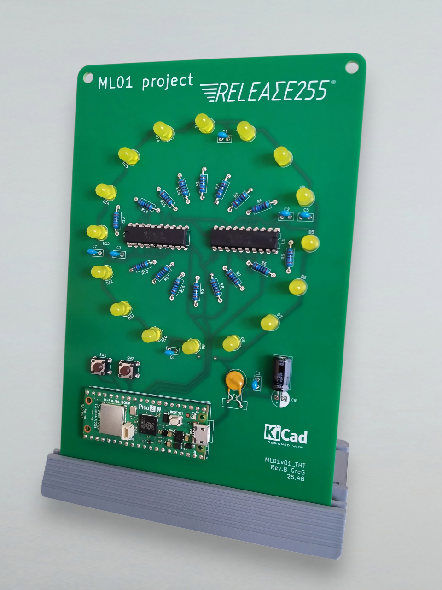
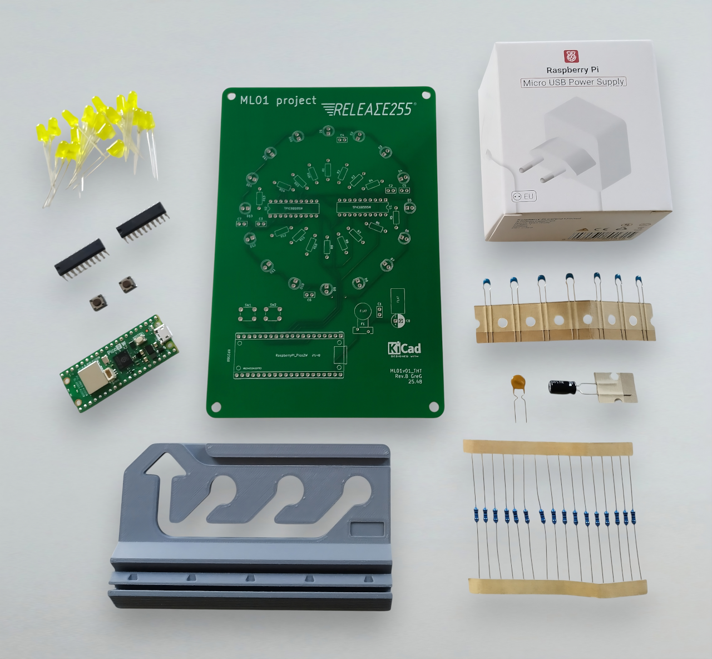
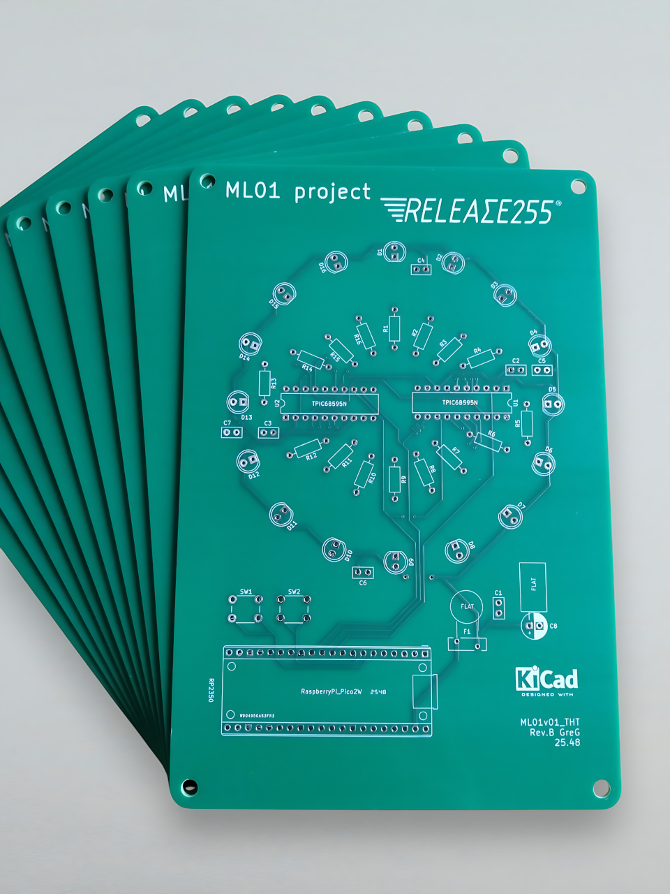
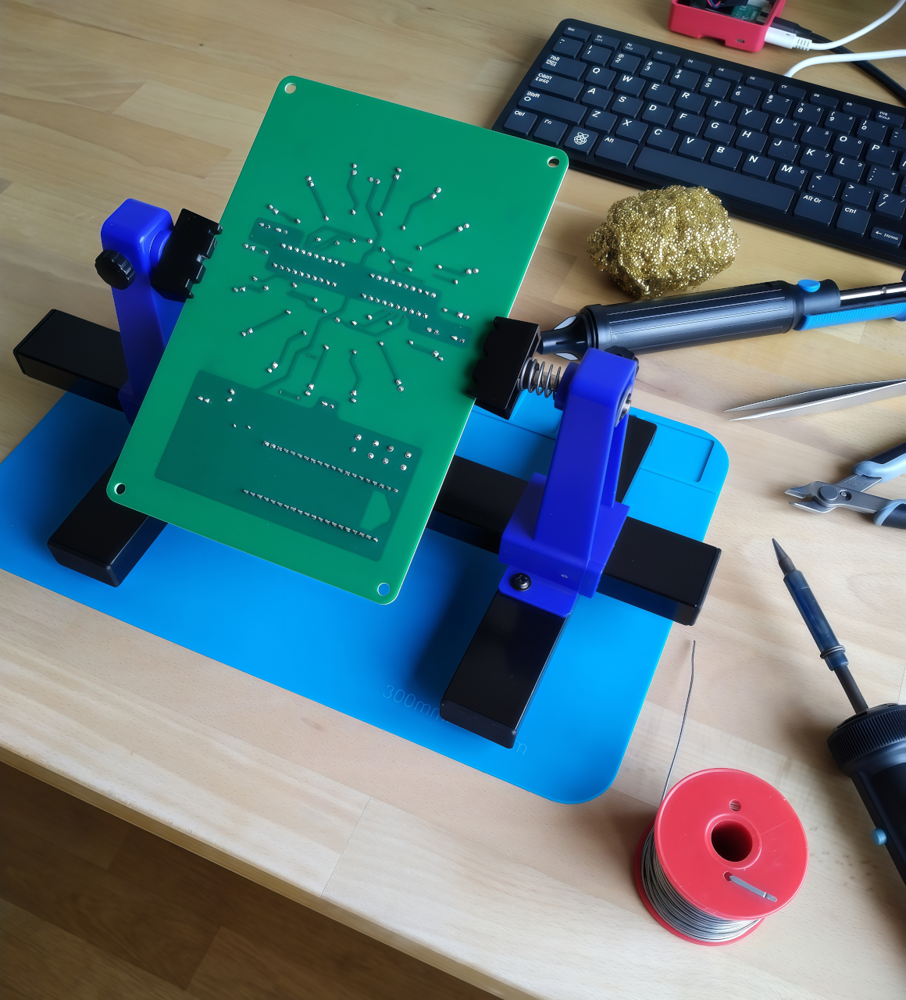
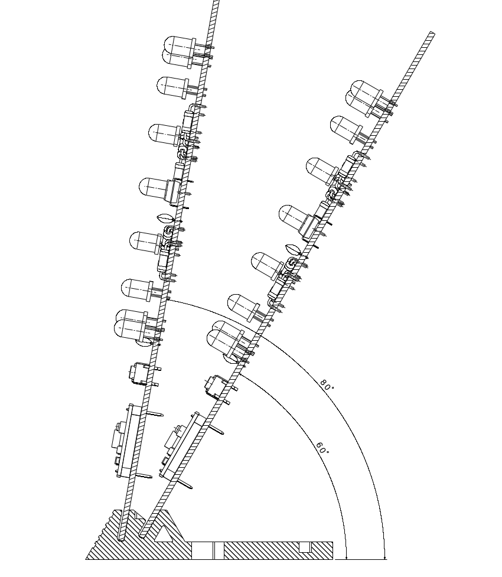
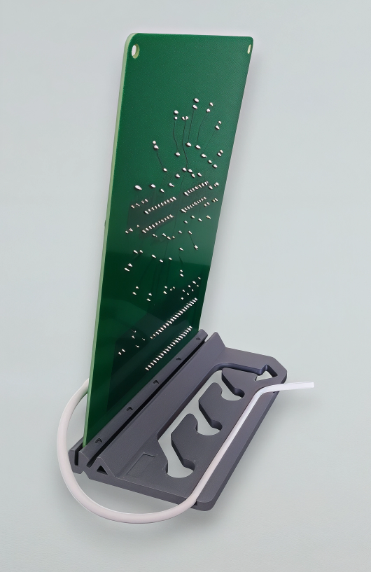
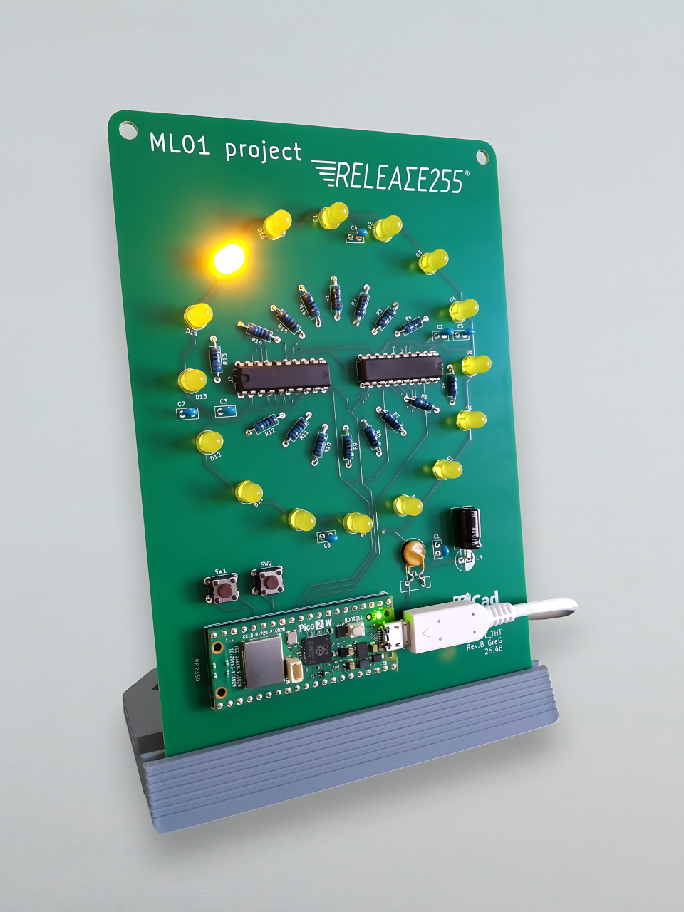
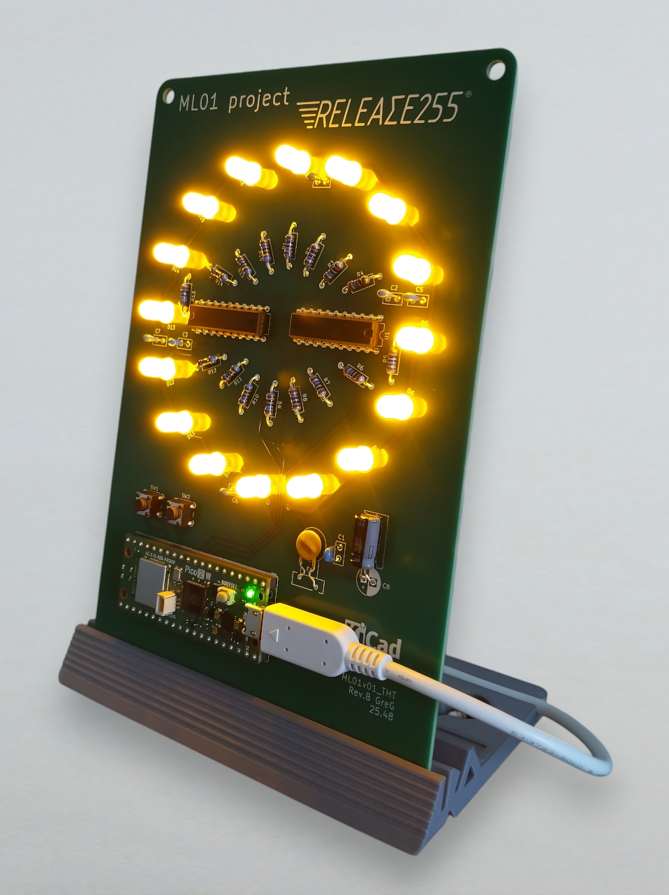

# ML01 project by RELEASE255
**DIY LED Board Powered by Raspberry Pico 2W**

[](/03_hardware/)
[](/02_firmware/)
[](/01_docs)
[](01_docs/costs.pdf)
[](LICENSE.md)

<p align="center">
<br>
<sub>ML01 Main image</sub>
</p>

---

# 💡 Overview

**ML01** is a fully DIY through-hole LED board driven by a **Raspberry Pi Pico 2W** and two **TPIC6B595** shift registers. Built for makers, learners, and electronic enthusiasts, this product combining:

- Electronics learning
- Soldering practice
- Microcontroller programming
- Wireless control via Microdot
- Possibility to customize the firmware and hardware
- Open hardware philosophy with protected PCB design

---

# 📋 Key Features

- **LED Circle** | 16 yellow LEDs driven by 2× TPIC power shift registers
- **Physical Controls** | 2 buttons to switch operating modes
- **Wireless Web Interface** | Autonomous Microdot server for full remote control
- **Mode 1 (FULL)** | Turn all LEDs on 
- **Mode 2 (CHASE)** | Minute indicator synchronized via an NTP server
- **100% DIY THT** | Perfect for beginners and maker who wish to assemble or repair their product
- **Upgradable Firmware** | New modes and features can be added anytime
- **Easy Powered** | Works with the included 12.5 W PSU or via USB
- **Budget Friendly** | Transparent and moderate costs coupled with low consumption (~1 Wh)

---

# 📦 Contents of the Kit

- 01x PCB
- 01x Raspberry Pi Pico 2W (THT version)
- 01x Raspberry power supply 12.5 W (5.1 V / 2.5 A)
- 02x TPIC6B595 (Power Shift Register)
- 16x Yellow LED (2500 mcd 60 deg)
- 16x Metal resistors 160Ω 
- 07x Ceramic capacitor (X7R 100 nF)
- 01x Electro radial capacitor (100µF)
- 01x Resettable fuse
- 02x Push buttons
- 01x PCB stand (not included, to be printed according to the provided 3D model)

<p align="center">
<br>
<sub>Complete DIY kit packaging</sub>
</p>

---

# 📸 Gallery

<p align="center">
  <br>
<sub>Bare PCB front view</sub>
</p>

<p align="center">
  <br>
<sub>DIY soldering THT components</sub>
</p>

<p align="center">
  <br>
<sub>Choice of orientation on the stand</sub>
</p>

<p align="center">
  <br>
<sub>PCB stand with cable holding</sub>
</p>

<p align="center">
  <br>
<sub>CHASE mode activated</sub>
</p>

<p align="center">
  <br>
<sub>FULL mode activated</sub>
</p>

<p align="center">
  <br>
<sub>Web interface for remote control</sub>
</p>

<p align="center">
  <br>
<sub>Web interface for log monitoring</sub>
</p>

<p align="center">
  <br>
  <sub>CHASE mode animated</sub>
</p>

---

# 📚 Documentation

## Specifications
See the document [Specifications](01_docs/ML01-specifications.md)

## Quick Start
1. **Solder** all components following the guide (⏱️ ~ 5 hours)
2. **Finishing** the PCB assembly with the cleaning
3. **Flash** the firmware to your Pico 2W
4. **Configure** the main.py file as you wish
5. **Transfer** the 3 files (main.py, index.html, microdot.py) to your pico
6. **Plug** the device to start the programm, it connects to your WiFi network
7. **Control** via web interface or the buttons

## Assembly  
Follow the complet guide to [Assembly](01_docs/ML01-assembly.md)

## Configuration  
Follow the complet guide to edit [Settings](01_docs/ML01-settings.md)

## Control & consult logs
Using the 2 physical buttons or the web interface, see the document [Usage](01_docs/ML01-usage.md)

---

# ⚠️ Disclaimer

- This is a **DIY kit requiring soldering**
- Assembly mistakes may damage components
- No warranty is provided
- Use at your own risk
- This device is intended for personal, non-commercial use only  
<br>
**It has not been tested or certified to meet:**
- CE electromagnetic compatibility standards
- FCC Part 15 regulations
- RoHS compliance (components should be RoHS-compliant when sourced)


---

# 🌐 Ecosystem

- **Official website:** *https://release255.com/*
- **Buy the kit:** *(Tindie link)*
- **3d stand:** *https://www.printables.com/model/1552197-pcb-stand*
- **Community:** *(Mastodon link)*
- **Project page:** *(Hackaday.io link)*

---

# 📜 License Overview

ML01 uses a **multi-license** & **balanced open source model.**  
The main license is MIT but other parts of the project use Creative Commons licenses.  
Below is the complete list of licenses used in the repository.  
If you have any question about licensing or permitted uses, contact the project maintainer.

| Category        | License         | File Types      | Commercial use   | Full text                                  |
|-----------------|-----------------|-----------------|------------------|--------------------------------------------|
| Firmware        | MIT             | `.py` `.html`   | ✅ Allowed       | [LICENSE](LICENSE)                         |
| BOM             | CC BY-SA 4.0    | `.pdf`          | ✅ Allowed       | [LICENSE](03_hardware/LICENSE-bom.md)      |
| Documentation   | CC BY-NC-SA 4.0 | `.pdf` `.md`    | 🚫 Not allowed   | [LICENSE](01_docs/LICENSE-docs.md)         |
| Technical plans | CC BY-NC-SA 4.0 | `.pdf`          | 🚫 Not allowed   | [LICENSE](03_hardware/LICENSE-hardware.md) |
| Schematics      | CC BY-NC-SA 4.0 | `.pdf`          | 🚫 Not allowed   | [LICENSE](03_hardware/LICENSE-hardware.md) |
| 3D Models       | CC BY-NC-SA 4.0 | `.stl` `.stp`   | 🚫 Not allowed   | [LICENSE](04_3dmodels/LICENSE-3dmodels.md) |
| Images          | CC BY-NC-SA 4.0 | `.png` `.jpg`   | 🚫 Not allowed   | [LICENSE](05_images/LICENSE-images.md)     |
| PCB Sources     | Proprietary     | Kicad & Gerbers | ❌ Not available | N/A                                        |

### 🔒 PCB sources remain proprietary

In order to preserve the value of the design, guarantee independence, sustainability and the protection of creators, the following elements are not available:

- KiCad source files
- PCB routing & layout
- Gerber files
- 3D model of the actual PCB

### Third-Party Dependencies and Licenses

The ML01 firmware uses two essential external components:

#### **MicroPython**
ML01 runs on MicroPython, a Python interpreter optimized for microcontrollers.
- **License MIT**
- **Author:** Damien P. George and contributors
- **Official website:** https://micropython.org
- **Full text license:** [here](02_firmware/LICENSE-micropython.md)  
ℹ️ The firmware provided in this repository may not necessarily be the latest version.

#### **Microdot**
Microdot is an ultra-lightweight web micro-framework used for the ML01 kit's HTML interface.
- **License MIT**
- **Author:** Miguel Grinberg
- **Official Repository:** https://github.com/miguelgrinberg/microdot
- **Full text license:** [here](02_firmware/LICENSE-microdot.md)  
ℹ️ The `microdot.py` file provided in this repository may not necessarily be the latest version.

---

# 🤝 Contributions & Collaboration

Contributions to the **firmware** and **documentation** are welcome!

- Open issues for bugs, ideas, or improvements
- Submit pull requests for code or docs
- Proprietary files cannot be modified

### Interested in partnering?
I'm open to collaborations with:

- Makers
- Hardware designers
- Open-source communities

Let's explore cross-promotion, joint tutorials, shared tools, or group orders.

---

# 🗂️ Repository Structure

```
ML01/
├── 01_docs/
│   ├── LICENSE-docs.md
│   ├── ML01-assembly.md
│   ├── ML01-costs.pdf
│   ├── ML01-settings.md
│   ├── ML01-specifications.md
│   └── ML01-usage.md
│
├── 02_firmware/
│   ├── LICENSE-firmware.md
│   ├── LICENSE-microdot.md
│   ├── LICENSE-micropython.md
│   ├── RPI_PICO2_W-YYYYMMDD-vX.XX.X.uf2
│   ├── index.html
│   ├── main.py
│   └── microdot.py
│
├── 03_hardware/
│   ├── LICENSE-bom.md
│   ├── LICENSE-hardware.md
│   ├── ML01-bom.pdf
│   ├── ML01-drawingA3.pdf
│   └── ML01-kicad-schematic.pdf
│
├── 04_3dmodels/
│   ├── LICENSE-3dmodels.md
│   ├── ML01-pcbstand-v01.stl
│   └── ML01-pcbstand-v01.stp
│
├── 05_images/
│   ├── assembly/
│   ├── product/
│   ├── settings/
│   ├── usage/
│   └── LICENSE-images.md
│
├── CHANGELOG.md
├── CONTRIBUTING.md
├── LICENSE
└── README.md
```

*Revision date: 2026.01.20*<br>
© RELEASE255 | All rights reserved
